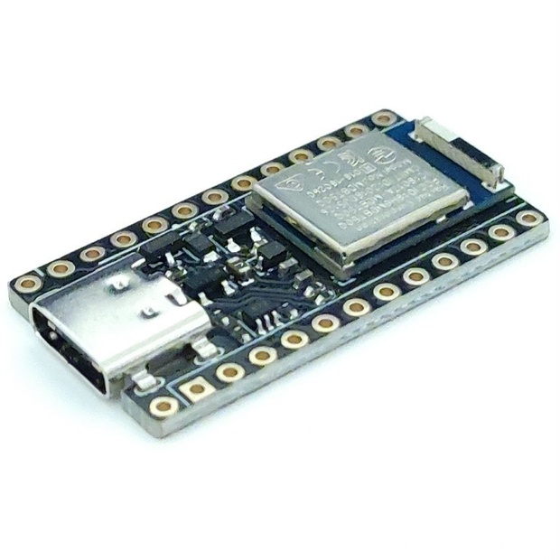
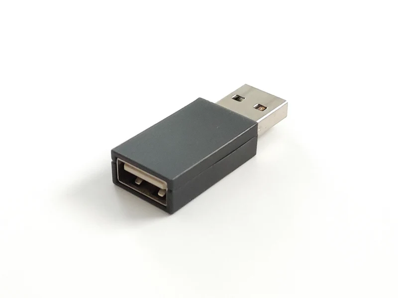
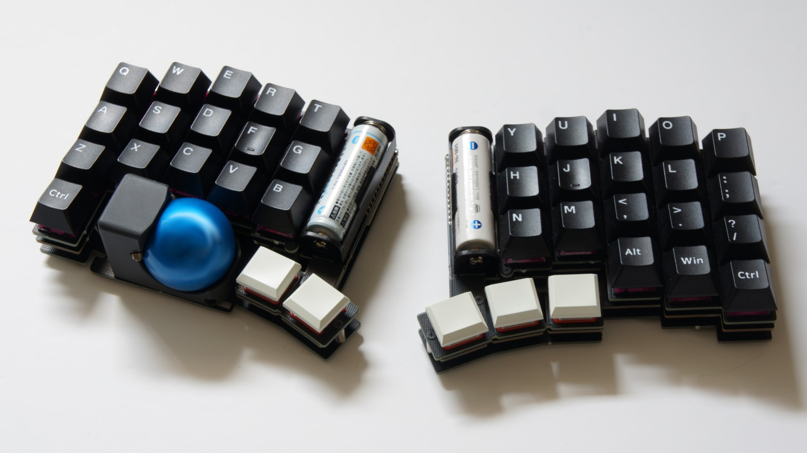

 せきごん(@_gonnoc)

  
  
  

---

## レツプリ祭り2024
## 非公式RTA

---

## ルール説明

1. 4x6x2の分割キーボード
2. PCBとケースを設計
3. コントローラボード（Pro Microなど）使用可
4. ツール使用無制限

---

## いまからやります

[ストップウォッチ](https://www.google.com/search?q=%E3%82%B9%E3%83%88%E3%83%83%E3%83%97%E3%82%A6%E3%82%A9%E3%83%83%E3%83%81)

---

[みんな大好きKiCADは使いません](https://sekigon-gonnoc.github.io/auto-kdk)